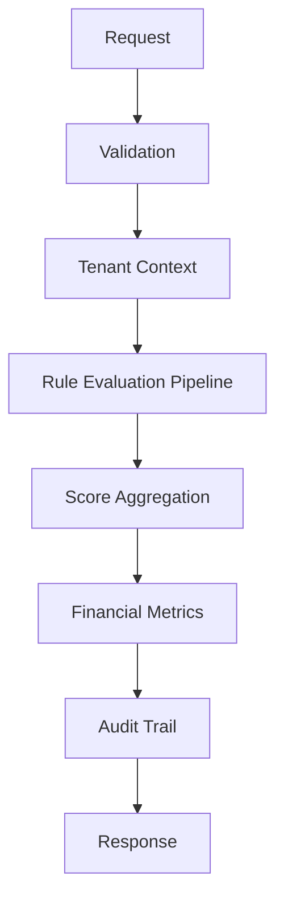

<div align="center">

# Cypher Engine

**Risk Intelligence Platform for Invoice Receivables Anticipation (NF-e)**


*Turning raw invoice data into intelligent, explainable credit decisions.*

</div>

---

## About

**Cypher** is a specialized risk intelligence engine built for **fintechs** and **B2B credit operations** focused on invoice receivables anticipation (NF-e).

Designed to support financial analysts and credit teams, Cypher delivers **transparent risk scoring**, rich operational metrics, and full auditability — enabling confident and data-driven decisions in receivables financing.

Instead of simple approve/reject outputs, Cypher provides deep contextual intelligence to enhance human decision-making.

---

## Key Features

### Explainable Risk Scoring
- Rule-based evaluation pipeline with full traceability
- Multi-dimensional risk assessment including:
    - SEFAZ invoice status
    - Issuer reliability
    - Buyer behavior patterns
    - Maturity window risk
    - Value anomalies
    - External data consistency
    - Operational red flags
- Individual rule contribution and weighting
- Intelligent fallback mechanisms with clear justification

### Multi-Tenant Architecture
Built as a truly multi-tenant system from day one, with complete logical isolation and tenant context propagation across all layers.

### Financial Intelligence
Automatically calculates key metrics:
- Expected Loss (EL)
- Risk-adjusted ROI
- Exposure indicators
- Recommended anticipation amount

### Full Auditability
Every analysis generates a complete audit trail including executed rules, fallback events, scores, timestamps, and contextual metadata.

---

## Architecture

**Modular Monolith** built with modern Java practices, prioritizing simplicity, maintainability, and operational excellence.

- **Language:** Java 21
- **Framework:** Spring Boot 3
- **Database:** PostgreSQL
- **Concurrency:** Virtual Threads (Project Loom)
- **Queue Strategy:** PostgreSQL `SKIP LOCKED`

**Design Philosophy:**  
Explainability first • Simplicity • Modularity without premature complexity

---

## Risk Engine Flow


Tech Stack
```mermaid
Layer           Technology   

Backend     --- Java 21 + Spring Boot 3
Security    --- Spring Security
Database    --- PostgreSQL
Build Tool  --- Maven
API Docs    --- OpenAPI / Swagger
CI/CD       --- GitHub Actions
Concurrency --- Virtual Threads + SKIP LOCKED
```

Project Status
Actively under development
✅ Completed

Full scoring pipeline and rule engine
Fallback and resilience mechanisms
Multi-tenant foundation
Complete audit infrastructure
Concurrency strategies
Operational validations

🚧 Roadmap

Web Dashboard (Frontend)
Advanced financial modeling
ML-assisted risk signals
Tenant-specific policy customization


Design Principles

Explainability over black-box decisions
Operational simplicity over unnecessary complexity
Modularity without premature distribution
Resilience through intelligent fallbacks
Domain-Driven Design


Developed by Pedro Andrade