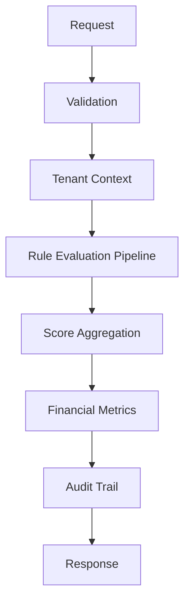

# Cypher Engine

**Risk Intelligence Platform for Invoice Receivables Anticipation (NF-e)**

*Turning raw invoice data into intelligent, explainable credit decisions.*

---

## About

**Cypher** is a specialized risk intelligence engine built for **fintechs** and **B2B credit operations** focused on invoice receivables anticipation (NF-e).

Designed to support financial analysts and credit teams, Cypher delivers **transparent risk scoring**, rich operational metrics, and full auditability — enabling confident and data-driven decisions in receivables financing.

Instead of simple approve/reject outputs, Cypher provides deep contextual intelligence to enhance human decision-making.

---

## Key Features

### Explainable Risk Scoring
- Rule-based evaluation pipeline with full traceability
- Multi-dimensional risk assessment including:
    - SEFAZ invoice status
    - Issuer reliability
    - Buyer behavior patterns
    - Maturity window risk
    - Value anomalies
    - External data consistency
    - Operational red flags
- Individual rule contribution and weighting
- Intelligent fallback mechanisms with clear justification

### Multi-Tenant Architecture
Built as a truly multi-tenant system from day one, with complete logical isolation and tenant context propagation across all layers.

### Financial Intelligence
Automatically calculates key metrics:
- Expected Loss (EL)
- Risk-adjusted ROI
- Exposure indicators
- Recommended anticipation amount

### Full Auditability
Every analysis generates a complete audit trail including executed rules, fallback events, scores, timestamps, and contextual metadata.

---

## Architecture

**Modular Monolith** built with modern Java practices, prioritizing simplicity, maintainability, and operational excellence.

- **Backend:** Java 21 + Spring Boot 3.3.5
- **Frontend:** React 19 + TypeScript + Vite 7
- **Database:** PostgreSQL with Flyway migrations
- **Cache / Idempotency:** Redis
- **Security:** Spring Security, JWT resource server, API key authentication
- **Observability:** Spring Boot Actuator, Micrometer tracing, OpenAPI / Swagger UI
- **Resilience:** Resilience4j circuit breakers for external integrations
- **Concurrency:** Virtual Threads (Project Loom)

**Design Philosophy:**  
Explainability first • Simplicity • Modularity without premature complexity

---

## Risk Engine Flow

## Tech Stack

### Backend
- Java 21
- Spring Boot 3.3.5
- Spring Web MVC
- Spring Data JPA / Hibernate
- Spring Validation
- Spring Security
- OAuth2 Resource Server / JWT
- API key authentication
- PostgreSQL
- Flyway
- Redis
- Resilience4j
- Spring Boot Actuator
- Micrometer Tracing with OpenTelemetry bridge
- Springdoc OpenAPI / Swagger UI
- Maven
- Lombok
- MapStruct

### Frontend
- React 19
- TypeScript
- Vite 7
- Tailwind CSS
- React Router
- TanStack React Query
- Axios
- Recharts
- Lucide React
- date-fns
- ESLint

### Testing
- JUnit 5
- Mockito
- Spring Boot Test
- Spring Security Test
- Testcontainers
- ArchUnit

### Infrastructure / Runtime
- PostgreSQL 13+
- Redis
- Virtual Threads enabled on the backend
- Local XML storage support
- External integration adapters for SEFAZ and Receita Federal

## Project Status

Actively under development.

### Completed
- Rule-based scoring engine
- Explainable risk factors
- Financial metrics calculation
- NF-e XML parsing
- SEFAZ status abstraction with fallback behavior
- Receita Federal company status integration layer
- Multi-tenant tenant context propagation
- API key and JWT authentication foundation
- Audit log infrastructure
- Idempotency layer backed by Redis
- Analysis history, statistics, and detail APIs
- React dashboard, history, analysis detail, and new analysis screens

### In Progress / Hardening
- Flyway migration reliability
- Frontend/backend contract alignment
- Production-safe frontend error handling
- Stronger idempotency guarantees
- End-to-end and migration testing
- Tenant-specific policy customization
- Advanced financial modeling
- ML-assisted risk signals

## Design Principles

- Explainability over black-box decisions
- Operational simplicity over unnecessary complexity
- Modularity without premature distribution
- Resilience through intelligent fallbacks
- Domain-Driven Design

Developed by Pedro Andrade
